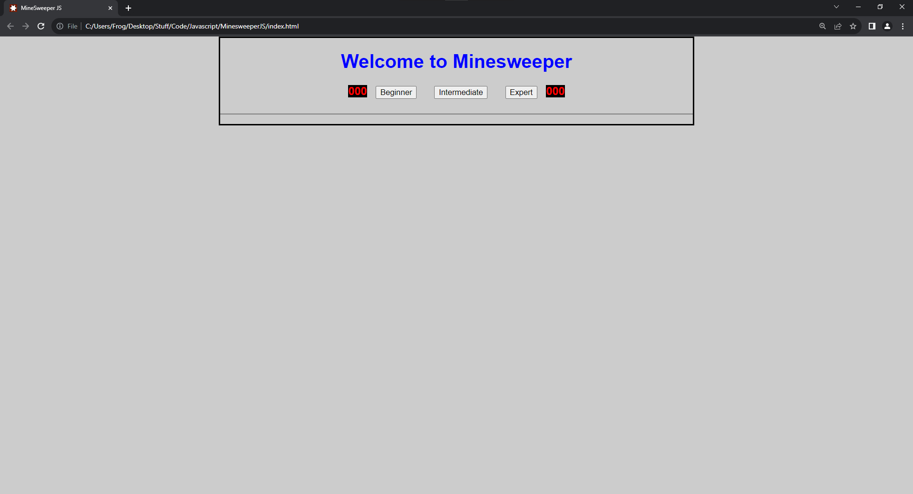
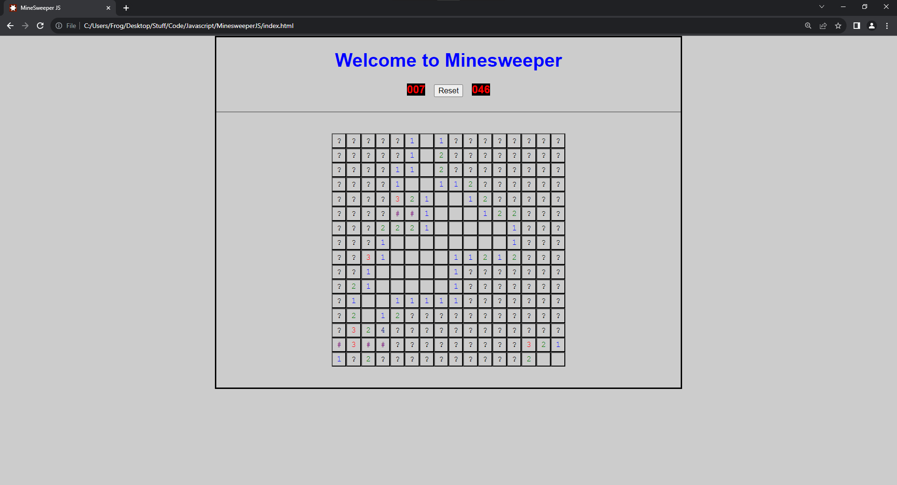

# Minesweeper JS

- A re-creation of the classic game Minesweeper, built with object oriented principles using HTML, CSS and Vanilla Javascript.
- Created for the final project of CP1210 Javascript in Year 2, Semester 4, of The College of the North Atlantic's [Software Development Co-op ](https://www.cna.nl.ca/program/software-development-co-op#tab2)course.


## Features / Differences

- Three difficulties are available: 
    - Beginner (81 tiles and 10 mines), 
    - Intermediate (256 tiles and 40 mines)  
    - Expert (480 tiles and 99 mines)
- Tiles can be flagged by right clicking them
- Flagged tiles are represented using a "#" colored purple
- Mine tiles are represented with a "-1" colored orange
- The left hand counter counts the total number of tiles clicks (unlike the original where it represented un-flagged mines)
- The right hand counter counts time starting from 0
- Tiles use the same coloring as the original game with the exception of flag and mine tiles


## Screenshots





## Run Locally

Clone the project

```bash
  git clone https://github.com/UnusualFrog
```

or Download the zip file directly from the repository and un-zip it.


Once the project is on your machine, simply double click the file 

```
MinesweeperJS/index.html
```

to open the game in either Google Chrome or Microsoft Edge (Firefox causes some bugs).

## Authors

- [@UnusualFrog](https://github.com/UnusualFrog)

